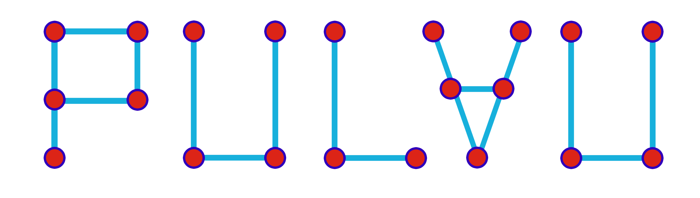

<p align="center">
  
</p>
<p align="center">
  <a href="https://github.com/zeon256/pulau-rs/blob/main/LICENSE">
    
  </a>
  <a href="https://docs.rs/pulau_rs">
    
  </a>
  <a href="https://zeon256.github.io/pulau-rs/pulau_rs/">
    
  </a>
  <a href="https://github.com/zeon256/pulau-rs/actions">
    
  </a>
</p>

# pulau-rs
Allocation-free UnionFind library for bare metal environments

The library provides the following algorithms that is used with `UnionFind`.
- QuickFind
- QuickUnion
- Weighted QuickUnion
- Weighted QuickUnion With Path Compression (Default)

## Asymptotic Complexity
| Algorithm                                        |             Struct              |  Init  |               Union |                Find |           Connected |
| :----------------------------------------------- | :-----------------------------: | :----: | ------------------: | ------------------: | ------------------: |
| QuickFind                                        |           `QuickFind`           | `O(N)` |              `O(N)` |              `O(1)` |              `O(1)` |
| QuickUnion                                       | `QuickUnion<UnWeighted, false>` | `O(N)` |              `O(N)` |              `O(N)` |              `O(N)` |
| Weighted (Rank) QuickUnion With Path Compression |   `QuickUnion<ByRank, true>`    | `O(N)` | `Amortized O(α(N))` | `Amortized O(α(N))` | `Amortized O(α(N))` |
| Weighted (Size) QuickUnion With Path Compression |   `QuickUnion<BySize, true>`    | `O(N)` | `Amortized O(α(N))` | `Amortized O(α(N))` | `Amortized O(α(N))` |

*Where `α` is the inverse [Ackermann function](https://en.wikipedia.org/wiki/Ackermann_function)

## Applications of UnionFind
- Checking for connected components in a graph
- Checking for cycles in a graph
- Searching for connected components in an image
- Finding minimum spanning tree using Kruskal

## Example Usage
```rust
use pulau_rs::{UnionFind, QuickFind, QuickUnion, BySize};
fn make_uf_quickfind() {
    // construct with quickfind algorithm with fixed size 10
    let mut uf = UnionFind::<QuickFind, u32, 10, 0>::new();
}

fn make_uf_quickunion() {
    // construct weighted quickunion with path compression algorithm with fixed size 10
    let mut uf = UnionFind::<QuickUnion, u32, 10>::new();
    // construct weighted quickunion with path compression using size heuristics and fixed size 10
    let mut uf_with_sz = UnionFind::<QuickUnion<BySize>, u8, 10>::new();
    uf.union_sets(1,2);
    uf.union_sets(2,3);
    uf.union_sets(2,3);
    assert!(uf.connected(1, 3));
}
```

### License
pulau-rs is licensed under MIT license (LICENSE-MIT or <http://opensource.org/licenses/MIT>)